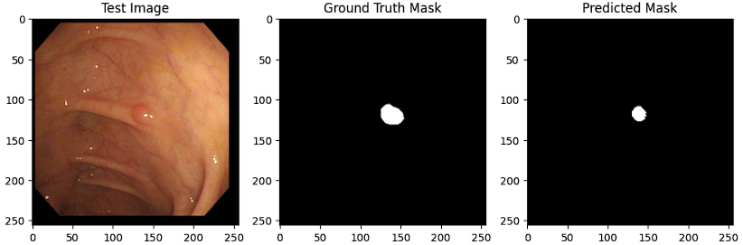
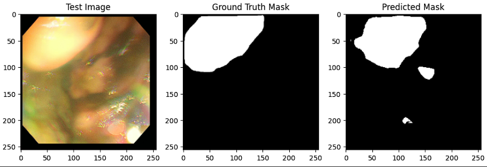
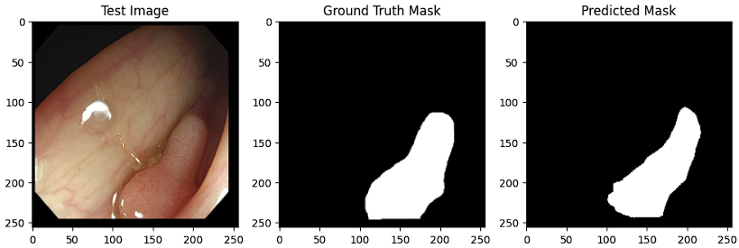
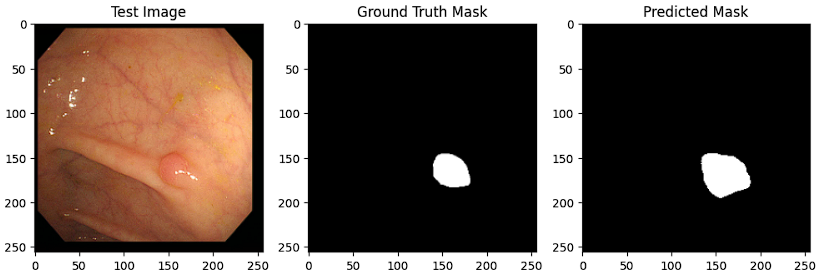
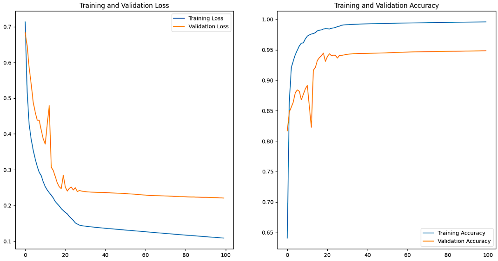

# ASPP Integrated UNet Model for Semantic Segmentation of Polyps

## Overview

This repository contains an ASPP (Atrous Spatial Pyramid Pooling) integrated UNet model designed for the task of semantic segmentation of polyps in medical images. The model utilizes deep learning techniques to accurately identify and segment polyps in endoscopy images or other medical imaging data.

Semantic segmentation is a crucial step in computer-aided diagnosis (CAD) systems, assisting medical professionals in the early detection and diagnosis of polyps, which are indicative of colorectal diseases.

## Key Features

- **ASPP Integration**: The model incorporates Atrous Spatial Pyramid Pooling (ASPP) to capture multi-scale contextual information effectively. This enhances the model's ability to distinguish between polyps and surrounding tissues at different levels of granularity.

- **UNet Architecture**: The UNet architecture is well-known for its success in medical image segmentation tasks. It features an encoder-decoder structure with skip connections, allowing the model to learn both high-level and low-level features for accurate segmentation.

- **Polyp Detection**: The model is trained to identify and segment polyps within medical images, providing pixel-level masks outlining the regions of interest.

- **Preprocessing and Post-processing**: The repository includes preprocessing and post-processing scripts to prepare input images and refine segmentation masks, improving the overall accuracy of the model.

- **Training Pipeline**: You can train the model on your own dataset using the provided training pipeline, which includes data augmentation, loss functions, and metrics for evaluation.

## Usage

To use the ASPP integrated UNet model for polyp segmentation, follow these steps:

1. **Data Preparation**: Organize your medical images and corresponding ground truth masks. Ensure that your dataset is split into training, validation, and test sets.

2. **Configuration**: Modify the configuration file to specify dataset paths, hyperparameters, and training settings. You can customize the model architecture, learning rate, batch size, etc.

3. **Training**: Train the model using the provided training script. Monitor the training process using metrics such as dice coefficient or pixel-wise accuracy.

4. **Inference**: Once the model is trained, you can perform inference on new medical images to obtain polyp segmentation masks.

5. **Post-processing**: Optionally, apply post-processing techniques to refine the segmentation results, such as connected component analysis or contour smoothing.

## Dependencies

The following Python libraries and dependencies are used in this project:

- **NumPy**: NumPy is a fundamental package for scientific computing with Python. It provides support for arrays and matrices, as well as mathematical functions.

- **OpenCV (cv2)**: OpenCV is an open-source computer vision and machine learning software library. It is used for image processing tasks in this code.

- **glob**: The glob module is used to find all pathnames matching a specified pattern according to the rules used by the Unix shell, although results are returned in arbitrary order.

- **scikit-learn (sklearn)**: Scikit-learn is a machine learning library for Python. In this code, it is used for data splitting and for the shuffle function.

- **TensorFlow**: TensorFlow is an open-source deep learning library. It is used for building and training neural networks, including the U-Net model in this code.

- **Pandas**: Pandas is a library for data manipulation and analysis. It is used to read and write CSV files.

- **tqdm**: tqdm is a library for adding progress bars to Python code. It is used for creating progress bars during data loading and processing.

Please make sure to install these dependencies in your Python environment to run the code successfully.

## Evaluation Metrics

The following evaluation metrics are used in this project for assessing the model's performance in semantic segmentation:

- **Intersection over Union (IoU)**: Measures the overlap between predicted and ground truth masks.

- **Precision**: Measures the accuracy of positive predictions.

- **Recall**: Measures the model's ability to capture all positive instances.

- **Accuracy**: Provides a general measure of model performance.

- **Loss (Binary Cross-Entropy)**: Quantifies the dissimilarity between predicted and ground truth masks.

These metrics are essential for evaluating the quality of the model's predictions and its ability to perform accurate semantic segmentation.

## Results

Our model for the semantic segmentation of polyps has shown outstanding performance on the dataset. Here are the key metrics that highlight the quality of our segmentation:

- **Accuracy**: The model achieved an accuracy of 97%, indicating that it correctly predicted polyp regions in 97% of cases.

- **Recall**: With a recall score of 91.87%, our model effectively identified 91.87% of all polyp regions present in the images.

- **Precision**: Our model demonstrated precise predictions with a precision score of 96.79%. This means that when it predicted polyp regions, it was correct in 96.79% of the cases.

- **Loss**: The model's loss function, which quantifies the dissimilarity between predicted and ground truth masks, is at 11.68%. This low loss value reflects the model's ability to make accurate predictions.

These impressive results highlight the effectiveness of our approach for the semantic segmentation of polyps. The high accuracy, combined with strong recall and precision, underscores the model's potential for assisting in medical image analysis and diagnosis.

The images of the acquired resultes are posted below:

The Accuracy vs Loss graph plotted for 100 epochs is:

## Authors

## Contact Information

For any inquiries or further information, please feel free to contact me via email:

- **Email**: [Rohan Kumar Sharma](mailto:srohan262@gmail.com)

## References
